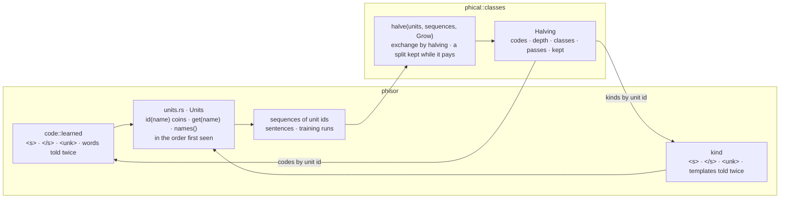

# units

```mermaid
graph LR
    subgraph phisor_["phisor"]
        words["code::learned<br/>&lt;s&gt; · &lt;/s&gt; · &lt;unk&gt; · words told twice"]
        temps["kind<br/>&lt;s&gt; · &lt;/s&gt; · &lt;unk&gt; · templates told twice"]
        units["units.rs · Units<br/>id(name) coins · get(name) · names()<br/>in the order first seen"]
        seqs["sequences of unit ids<br/>sentences · training runs"]
    end
    subgraph phical_["phical::classes"]
        halve["halve(units, sequences, Grow)<br/>exchange by halving · a split kept while it pays"]
        halving["Halving<br/>codes · depth · classes · passes · kept"]
    end
    words --> units
    temps --> units
    units --> seqs --> halve --> halving
    halving -->|"codes by unit id"| words
    halving -->|"kinds by unit id"| temps
```
