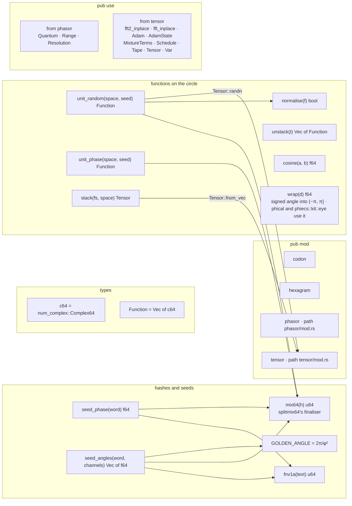
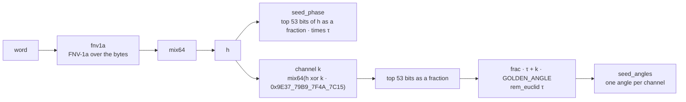
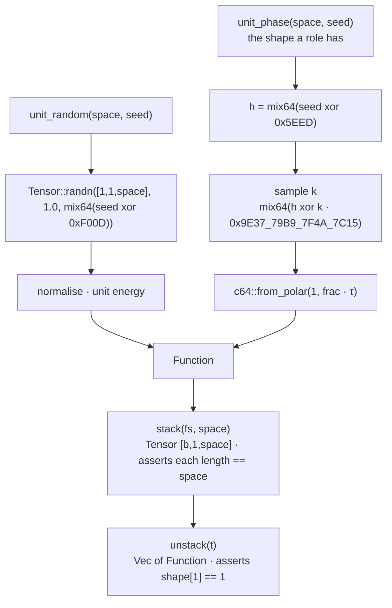
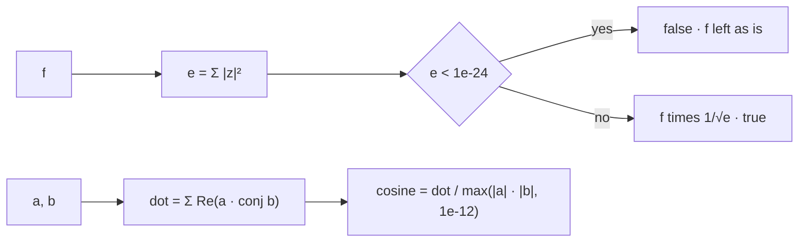
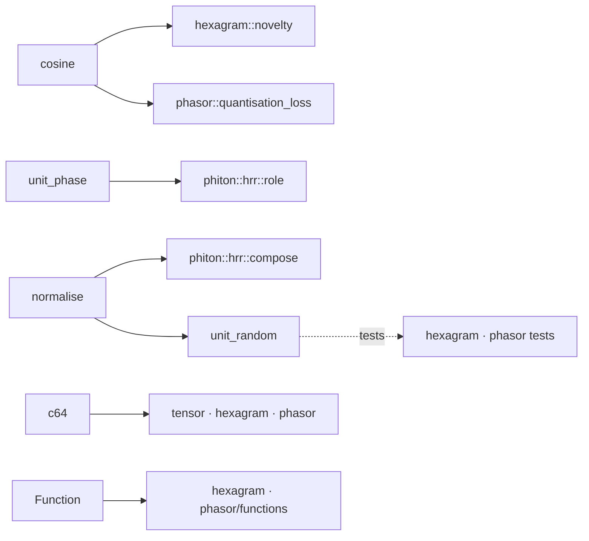

# lib

## Inside lib.rs

```mermaid
graph LR
    subgraph mods["pub mod"]
        m1["codon"]
        m2["hexagram"]
        m4["phasor · path phasor/mod.rs"]
        m5["tensor · path tensor/mod.rs"]
    end
    subgraph types["types"]
        tc["c64 = num_complex::Complex64"]
        tf["Function = Vec of c64"]
    end
    subgraph hashes["hashes and seeds"]
        fnv["fnv1a(text) u64"]
        mix["mix64(h) u64<br/>splitmix64's finaliser"]
        gold["GOLDEN_ANGLE = 2π/φ²"]
        sp["seed_phase(word) f64"]
        sa["seed_angles(word, channels) Vec of f64"]
    end
    subgraph funcs["functions on the circle"]
        nor["normalise(f) bool"]
        ur["unit_random(space, seed) Function"]
        up["unit_phase(space, seed) Function"]
        stk["stack(fs, space) Tensor"]
        ust["unstack(t) Vec of Function"]
        cos["cosine(a, b) f64"]
        wrp["wrap(d) f64<br/>signed angle into (−π, π] · phical and phiecs::kit::eye use it"]
    end
    subgraph reexp["pub use"]
        rp["from phasor<br/>Quantum · Range · Resolution"]
        rt["from tensor<br/>fft2_inplace · fft_inplace · Adam · AdamState<br/>MixtureTerms · Schedule · Tape · Tensor · Var"]
    end
    sp --> fnv
    sp --> mix
    sa --> fnv
    sa --> mix
    sa --> gold
    ur --> mix
    ur --> nor
    ur -->|"Tensor::randn"| m5
    up --> mix
    stk -->|"Tensor::from_vec"| m5
```

## The seed — one word, the same angles everywhere

```mermaid
flowchart LR
    W["word"] --> F["fnv1a<br/>FNV-1a over the bytes"] --> M["mix64"] --> H["h"]
    H --> SP["seed_phase<br/>top 53 bits of h as a fraction · times τ"]
    H --> K["channel k<br/>mix64(h xor k · 0x9E37_79B9_7F4A_7C15)"]
    K --> FR["top 53 bits as a fraction"]
    FR --> A["frac · τ + k · GOLDEN_ANGLE<br/>rem_euclid τ"]
    A --> OUT["seed_angles<br/>one angle per channel"]
```

## Making a function

```mermaid
flowchart TD
    UR["unit_random(space, seed)"] --> RN["Tensor::randn([1,1,space], 1.0, mix64(seed xor 0xF00D))"]
    RN --> NZ["normalise · unit energy"]
    UP["unit_phase(space, seed)<br/>the shape a role has"] --> H2["h = mix64(seed xor 0x5EED)"]
    H2 --> PK["sample k<br/>mix64(h xor k · 0x9E37_79B9_7F4A_7C15)"]
    PK --> PL["c64::from_polar(1, frac · τ)"]
    NZ --> FN["Function"]
    PL --> FN
    FN --> ST["stack(fs, space)<br/>Tensor [b,1,space] · asserts each length == space"]
    ST --> US["unstack(t)<br/>Vec of Function · asserts shape[1] == 1"]
```

## normalise and cosine

```mermaid
flowchart LR
    F["f"] --> E["e = Σ |z|²"] --> Q{"e #lt; 1e-24"}
    Q -->|"yes"| Z["false · f left as is"]
    Q -->|"no"| S["f times 1/√e · true"]
    A["a, b"] --> D["dot = Σ Re(a · conj b)"]
    D --> C["cosine = dot / max(|a| · |b|, 1e-12)"]
```

## Who calls the root

```mermaid
graph LR
    cos["cosine"] --> nv["hexagram::novelty"]
    cos --> ql["phasor::quantisation_loss"]
    up["unit_phase"] --> rl["phiton::hrr::role"]
    nor["normalise"] --> cp["phiton::hrr::compose"]
    nor --> ur["unit_random"]
    ur -.->|"tests"| ts["hexagram · phasor tests"]
    tf["c64"] --> fu["tensor · hexagram · phasor"]
    tf2["Function"] --> fu2["hexagram · phasor/functions"]
```
