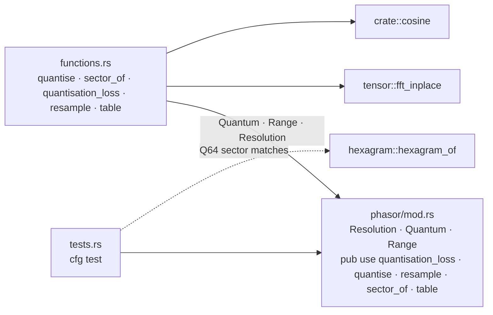
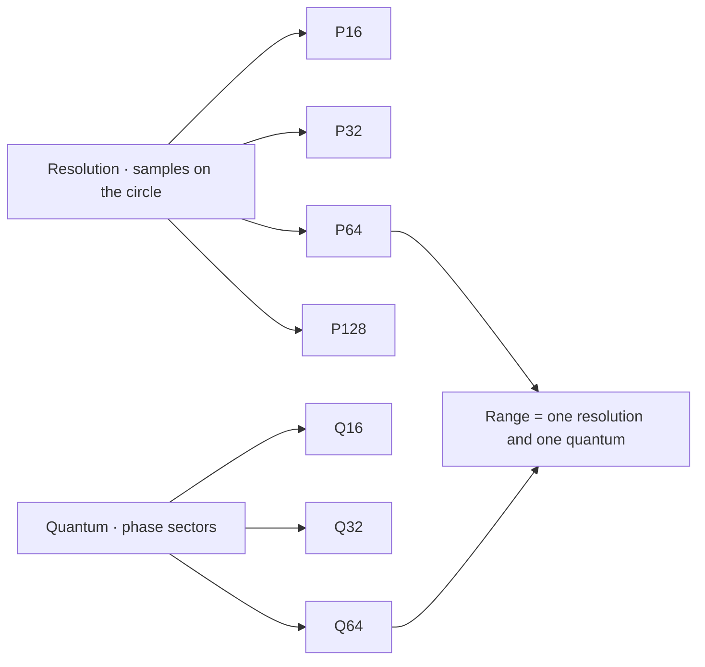
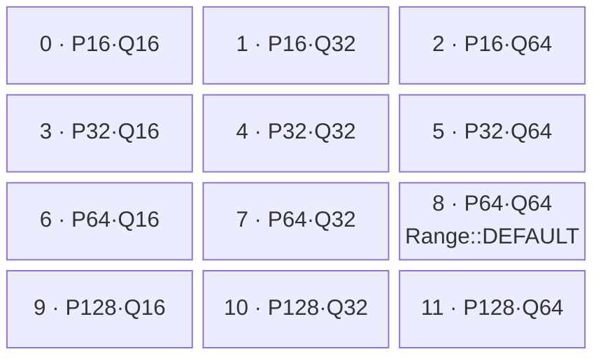
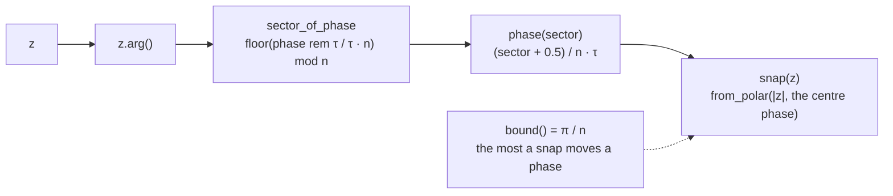
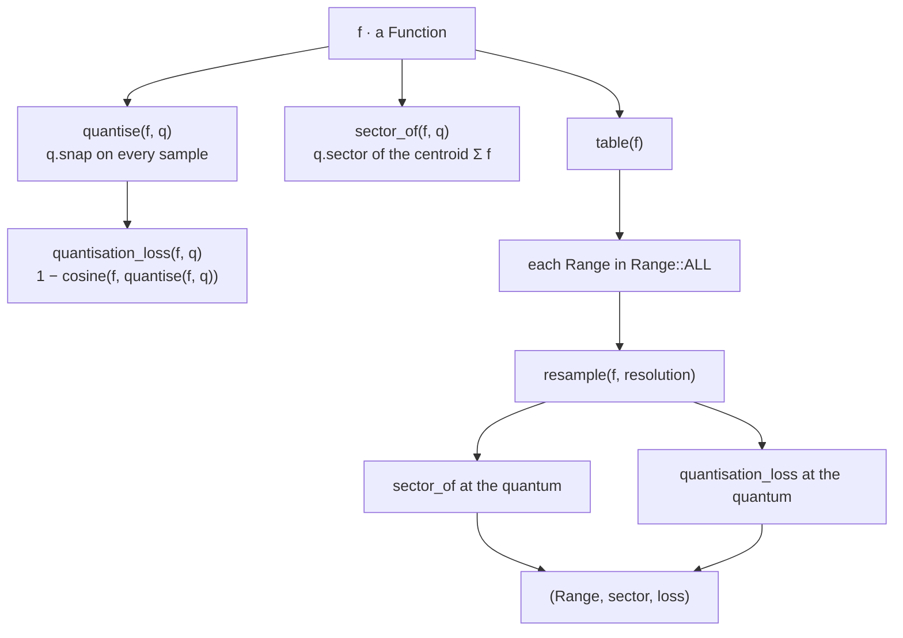
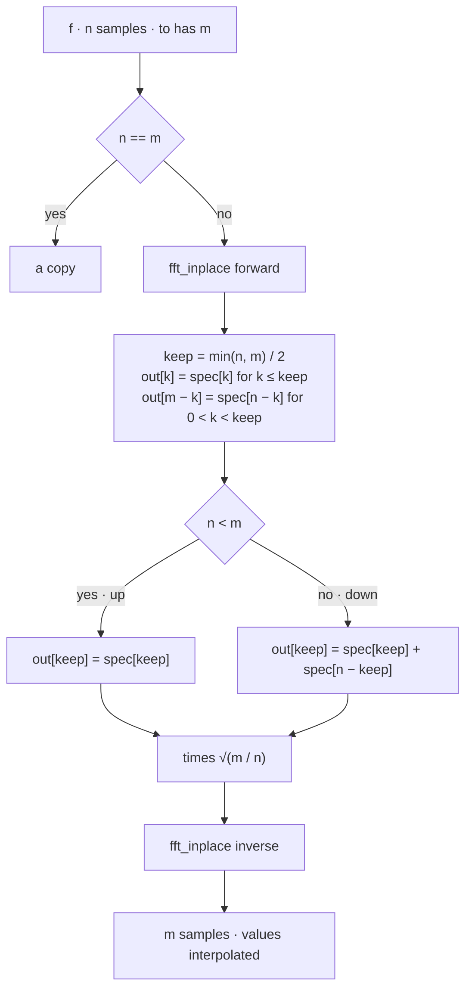
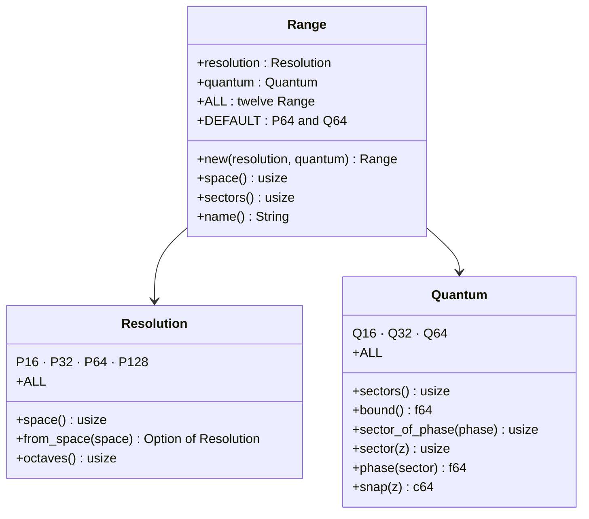
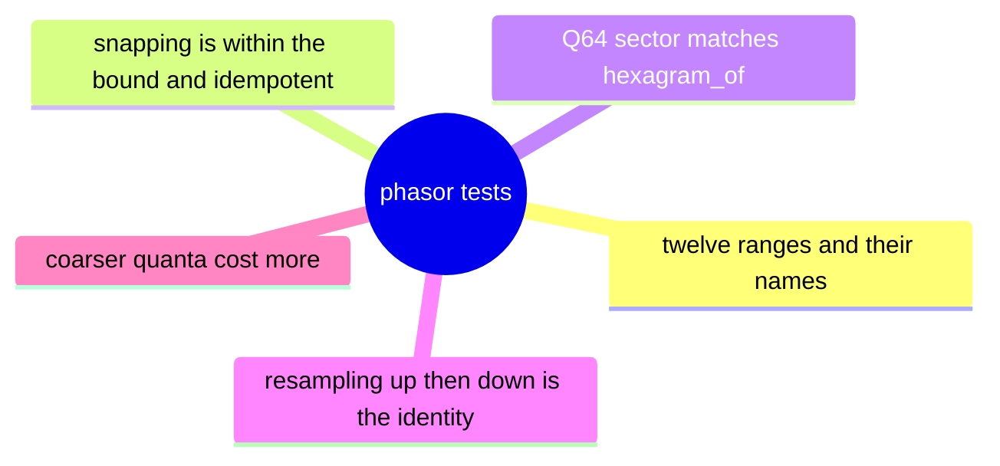

# phasor

## Files

```mermaid
graph LR
    mod["phasor/mod.rs<br/>Resolution · Quantum · Range<br/>pub use quantisation_loss · quantise · resample · sector_of · table"]
    functions["functions.rs<br/>quantise · sector_of · quantisation_loss · resample · table"]
    tests["tests.rs<br/>cfg test"]
    fft["tensor::fft_inplace"]
    cos["crate::cosine"]
    hx["hexagram::hexagram_of"]
    functions -->|"Quantum · Range · Resolution"| mod
    functions --> fft
    functions --> cos
    tests --> mod
    tests -.->|"Q64 sector matches"| hx
```

## Two axes

```mermaid
graph LR
    R["Resolution · samples on the circle"] --> P16["P16"]
    R --> P32["P32"]
    R --> P64["P64"]
    R --> P128["P128"]
    Q["Quantum · phase sectors"] --> Q16["Q16"]
    Q --> Q32["Q32"]
    Q --> Q64["Q64"]
    P64 --> RG["Range = one resolution and one quantum"]
    Q64 --> RG
```

## The twelve — Range::ALL, in order

```mermaid
block-beta
    columns 3
    r0["0 · P16·Q16"] r1["1 · P16·Q32"] r2["2 · P16·Q64"]
    r3["3 · P32·Q16"] r4["4 · P32·Q32"] r5["5 · P32·Q64"]
    r6["6 · P64·Q16"] r7["7 · P64·Q32"] r8["8 · P64·Q64<br/>Range::DEFAULT"]
    r9["9 · P128·Q16"] r10["10 · P128·Q32"] r11["11 · P128·Q64"]
```

## A quantum snaps a phase

```mermaid
flowchart LR
    Z["z"] --> A["z.arg()"] --> SP["sector_of_phase<br/>floor(phase rem τ / τ · n) mod n"]
    SP --> PH["phase(sector)<br/>(sector + 0.5) / n · τ"]
    PH --> SN["snap(z)<br/>from_polar(|z|, the centre phase)"]
    B["bound() = π / n<br/>the most a snap moves a phase"] -.-> SN
```

## Functions over a range

```mermaid
flowchart TD
    F["f · a Function"] --> Q["quantise(f, q)<br/>q.snap on every sample"]
    F --> S["sector_of(f, q)<br/>q.sector of the centroid Σ f"]
    Q --> L["quantisation_loss(f, q)<br/>1 − cosine(f, quantise(f, q))"]
    F --> T["table(f)"]
    T --> E["each Range in Range::ALL"]
    E --> RS["resample(f, resolution)"]
    RS --> S2["sector_of at the quantum"]
    RS --> L2["quantisation_loss at the quantum"]
    S2 --> ROW["(Range, sector, loss)"]
    L2 --> ROW
```

## resample(f, to)

```mermaid
flowchart TD
    F["f · n samples · to has m"] --> EQ{"n == m"}
    EQ -->|"yes"| CP["a copy"]
    EQ -->|"no"| FF["fft_inplace forward"]
    FF --> KP["keep = min(n, m) / 2<br/>out[k] = spec[k] for k ≤ keep<br/>out[m − k] = spec[n − k] for 0 #lt; k #lt; keep"]
    KP --> NY{"n #lt; m"}
    NY -->|"yes · up"| N1["out[keep] = spec[keep]"]
    NY -->|"no · down"| N2["out[keep] = spec[keep] + spec[n − keep]"]
    N1 --> SC["times √(m / n)"]
    N2 --> SC
    SC --> IF["fft_inplace inverse"]
    IF --> OUT["m samples · values interpolated"]
```

## The types

```mermaid
classDiagram
    class Resolution {
        P16 · P32 · P64 · P128
        +ALL
        +space() usize
        +from_space(space) Option of Resolution
        +octaves() usize
    }
    class Quantum {
        Q16 · Q32 · Q64
        +ALL
        +sectors() usize
        +bound() f64
        +sector_of_phase(phase) usize
        +sector(z) usize
        +phase(sector) f64
        +snap(z) c64
    }
    class Range {
        +resolution : Resolution
        +quantum : Quantum
        +ALL : twelve Range
        +DEFAULT : P64 and Q64
        +new(resolution, quantum) Range
        +space() usize
        +sectors() usize
        +name() String
    }
    Range --> Resolution
    Range --> Quantum
```

## What tests.rs holds

```mermaid
mindmap
  root((phasor tests))
    twelve ranges and their names
    snapping is within the bound and idempotent
    Q64 sector matches hexagram_of
    resampling up then down is the identity
    coarser quanta cost more
```
