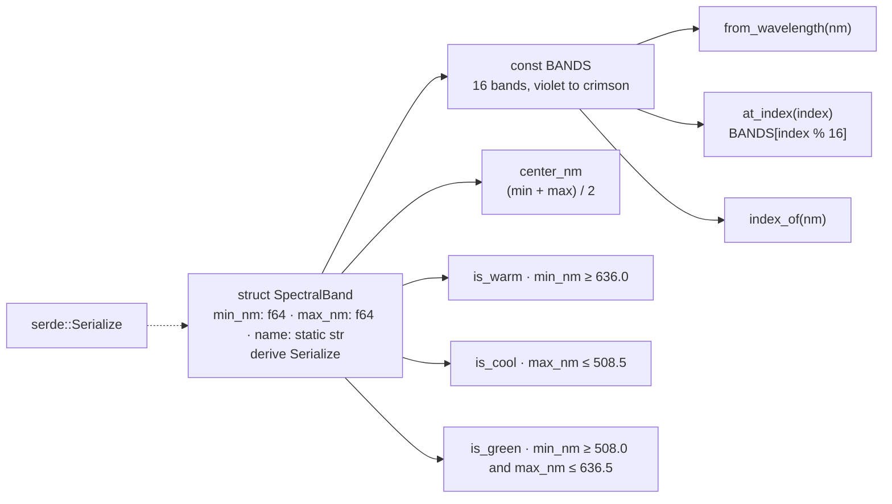
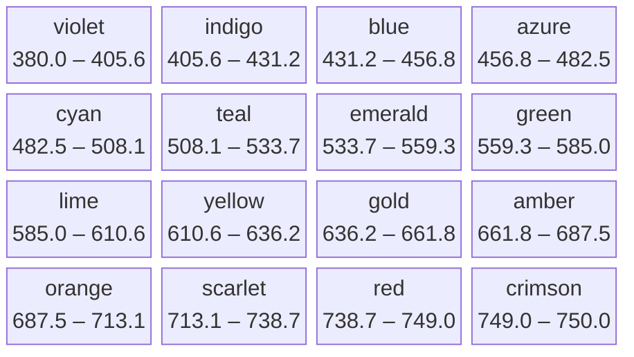
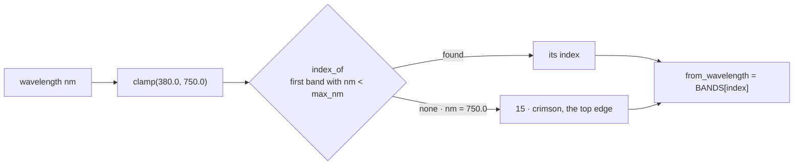
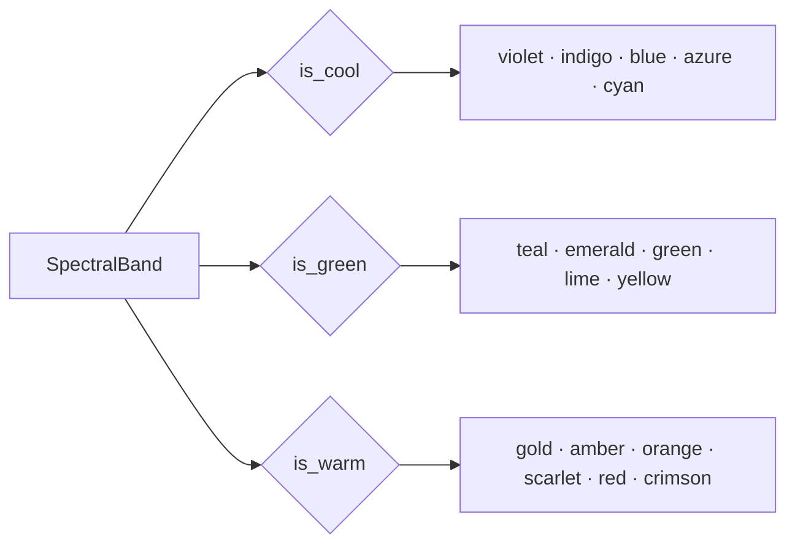
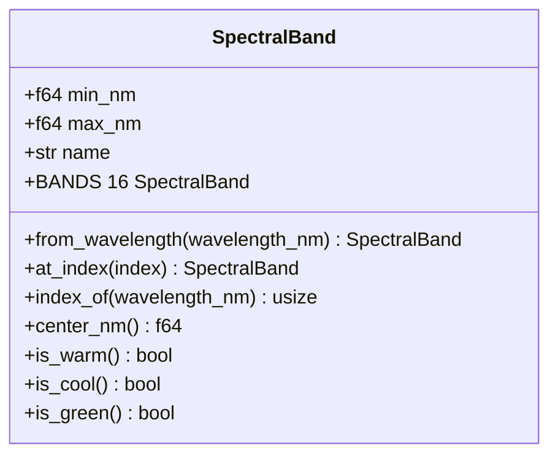

# bands

## Inside bands.rs

```mermaid
graph LR
    sb["struct SpectralBand<br/>min_nm: f64 · max_nm: f64 · name: static str<br/>derive Serialize"]
    bands["const BANDS<br/>16 bands, violet to crimson"]
    fw["from_wavelength(nm)"]
    ai["at_index(index)<br/>BANDS[index % 16]"]
    io["index_of(nm)"]
    cn["center_nm<br/>(min + max) / 2"]
    warm["is_warm · min_nm ≥ 636.0"]
    cool["is_cool · max_nm ≤ 508.5"]
    green["is_green · min_nm ≥ 508.0 and max_nm ≤ 636.5"]
    serde["serde::Serialize"]
    sb --> bands
    bands --> fw
    bands --> ai
    bands --> io
    sb --> cn
    sb --> warm
    sb --> cool
    sb --> green
    serde -.-> sb
```

## The 16 bands, in nm

```mermaid
block-beta
    columns 4
    b0["violet<br/>380.0 – 405.6"] b1["indigo<br/>405.6 – 431.2"] b2["blue<br/>431.2 – 456.8"] b3["azure<br/>456.8 – 482.5"]
    b4["cyan<br/>482.5 – 508.1"] b5["teal<br/>508.1 – 533.7"] b6["emerald<br/>533.7 – 559.3"] b7["green<br/>559.3 – 585.0"]
    b8["lime<br/>585.0 – 610.6"] b9["yellow<br/>610.6 – 636.2"] b10["gold<br/>636.2 – 661.8"] b11["amber<br/>661.8 – 687.5"]
    b12["orange<br/>687.5 – 713.1"] b13["scarlet<br/>713.1 – 738.7"] b14["red<br/>738.7 – 749.0"] b15["crimson<br/>749.0 – 750.0"]
```

## Finding a band

```mermaid
flowchart LR
    NM["wavelength nm"] --> CL["clamp(380.0, 750.0)"]
    CL --> POS{"index_of<br/>first band with nm #lt; max_nm"}
    POS -->|"found"| IDX["its index"]
    POS -->|"none · nm = 750.0"| LAST["15 · crimson, the top edge"]
    IDX & LAST --> FW["from_wavelength = BANDS[index]"]
```

## Warm, cool, green

```mermaid
flowchart LR
    B["SpectralBand"] --> C{"is_cool"}
    B --> G{"is_green"}
    B --> W{"is_warm"}
    C --> C1["violet · indigo · blue · azure · cyan"]
    G --> G1["teal · emerald · green · lime · yellow"]
    W --> W1["gold · amber · orange · scarlet · red · crimson"]
```

## The type

```mermaid
classDiagram
    class SpectralBand {
        +f64 min_nm
        +f64 max_nm
        +str name
        +BANDS 16 SpectralBand
        +from_wavelength(wavelength_nm) SpectralBand
        +at_index(index) SpectralBand
        +index_of(wavelength_nm) usize
        +center_nm() f64
        +is_warm() bool
        +is_cool() bool
        +is_green() bool
    }
```
