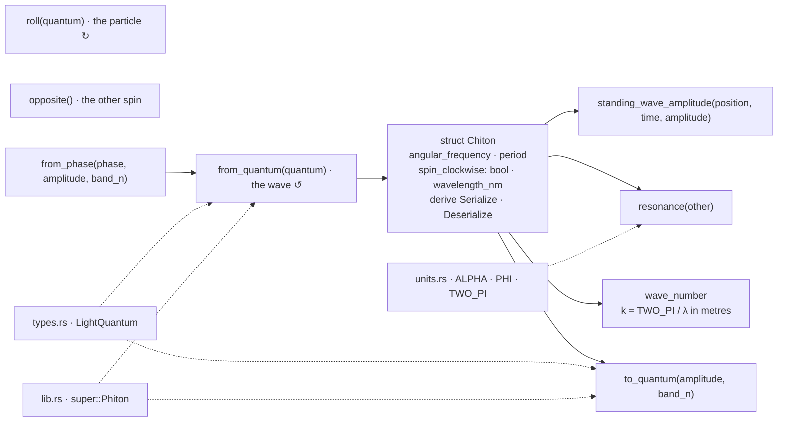
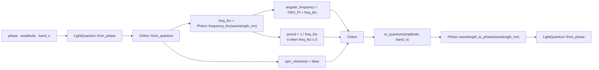
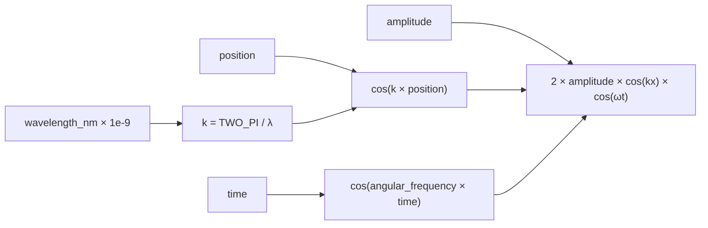
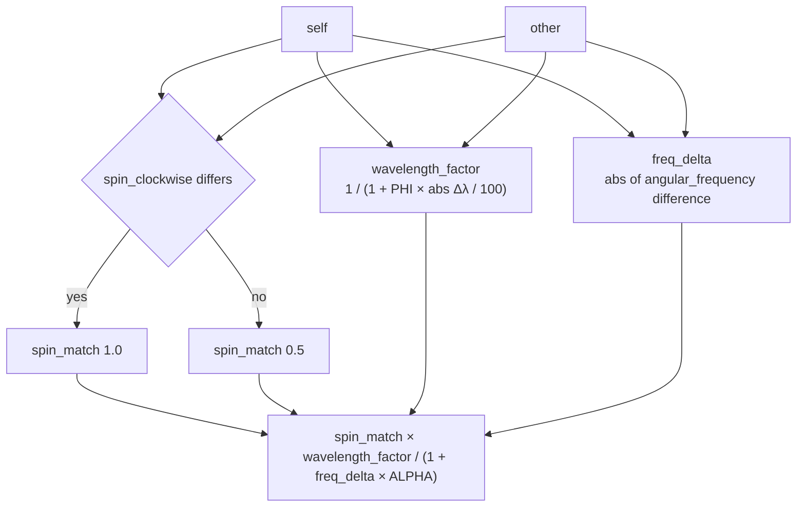
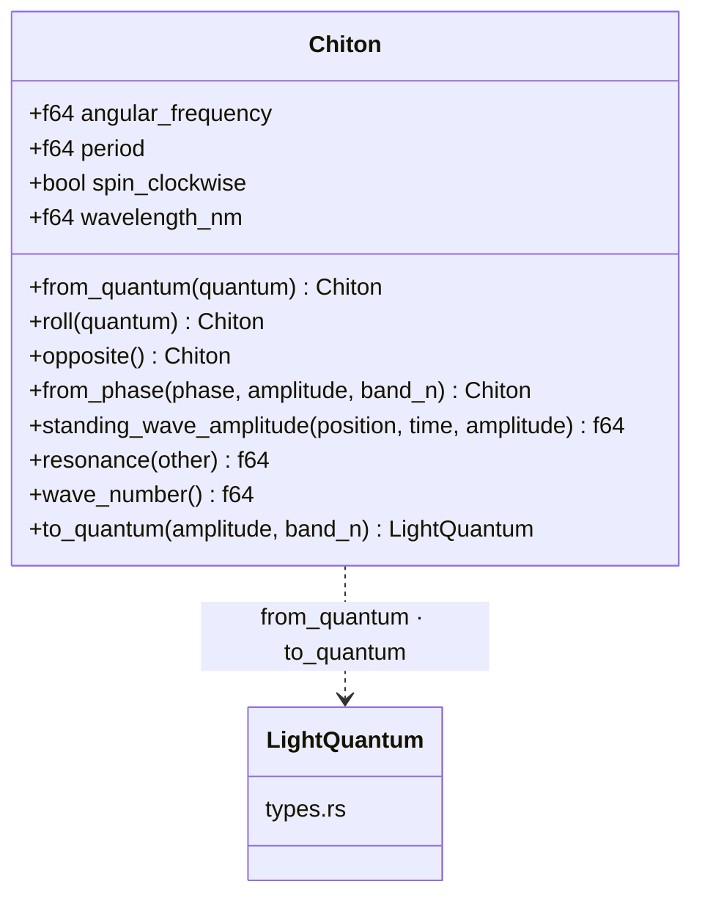

# chiton

## Inside chiton.rs

```mermaid
graph LR
    ch["struct Chiton<br/>angular_frequency · period<br/>spin_clockwise: bool · wavelength_nm<br/>derive Serialize · Deserialize"]
    fq["from_quantum(quantum) · the wave ↺"]
    rl["roll(quantum) · the particle ↻"]
    op["opposite() · the other spin"]
    fp["from_phase(phase, amplitude, band_n)"]
    sw["standing_wave_amplitude(position, time, amplitude)"]
    rs["resonance(other)"]
    wn["wave_number<br/>k = TWO_PI / λ in metres"]
    tq["to_quantum(amplitude, band_n)"]
    types["types.rs · LightQuantum"]
    units["units.rs · ALPHA · PHI · TWO_PI"]
    lib["lib.rs · super::Phiton"]
    fp --> fq --> ch
    ch --> sw
    ch --> rs
    ch --> wn
    ch --> tq
    types -.-> fq
    types -.-> tq
    units -.-> rs
    lib -.-> fq
    lib -.-> tq
```

## Phiton to chiton to phiton

```mermaid
flowchart LR
    P["phase · amplitude · band_n"] --> LQ["LightQuantum::from_phase"]
    LQ --> FQ["Chiton::from_quantum"]
    FQ --> F["freq_thz = Phiton::frequency_thz(wavelength_nm)"]
    F --> W["angular_frequency = TWO_PI × freq_thz"]
    F --> T["period = 1 / freq_thz<br/>0 when freq_thz ≤ 0"]
    FQ --> S["spin_clockwise = false"]
    W & T & S --> CH["Chiton"]
    CH --> TQ["to_quantum(amplitude, band_n)"]
    TQ --> PH["Phiton::wavelength_to_phase(wavelength_nm)"]
    PH --> LQ2["LightQuantum::from_phase"]
```

## A standing wave

```mermaid
flowchart LR
    NM["wavelength_nm × 1e-9"] --> K["k = TWO_PI / λ"]
    X["position"] --> CX["cos(k × position)"]
    K --> CX
    TT["time"] --> CT["cos(angular_frequency × time)"]
    A0["amplitude"] --> A["2 × amplitude × cos(kx) × cos(ωt)"]
    CX --> A
    CT --> A
```

## Two chitons resonate

```mermaid
flowchart TD
    A["self"] --> D["freq_delta<br/>abs of angular_frequency difference"]
    B["other"] --> D
    A --> SP{"spin_clockwise differs"}
    B --> SP
    SP -->|"yes"| S1["spin_match 1.0"]
    SP -->|"no"| S2["spin_match 0.5"]
    A --> WF["wavelength_factor<br/>1 / (1 + PHI × abs Δλ / 100)"]
    B --> WF
    S1 & S2 --> R["spin_match × wavelength_factor / (1 + freq_delta × ALPHA)"]
    WF --> R
    D --> R
```

## The type

```mermaid
classDiagram
    class Chiton {
        +f64 angular_frequency
        +f64 period
        +bool spin_clockwise
        +f64 wavelength_nm
        +from_quantum(quantum) Chiton
        +roll(quantum) Chiton
        +opposite() Chiton
        +from_phase(phase, amplitude, band_n) Chiton
        +standing_wave_amplitude(position, time, amplitude) f64
        +resonance(other) f64
        +wave_number() f64
        +to_quantum(amplitude, band_n) LightQuantum
    }
    class LightQuantum {
        types.rs
    }
    Chiton ..> LightQuantum : from_quantum · to_quantum
```
