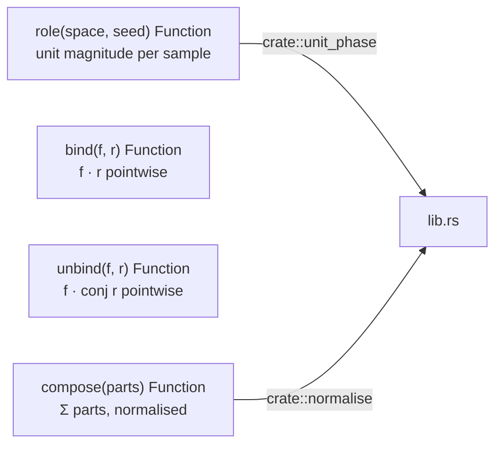
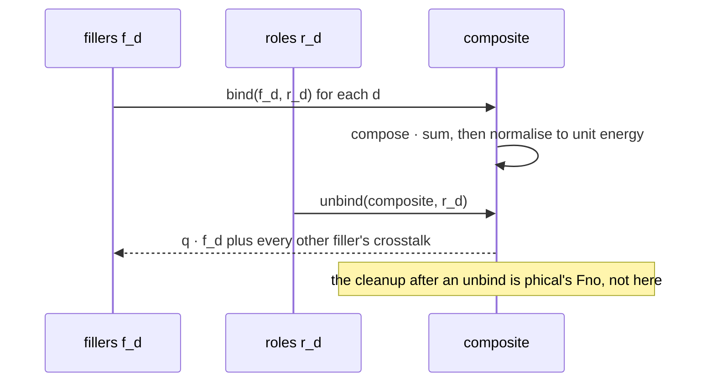
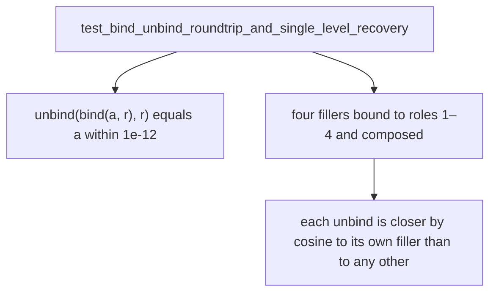

# hrr

## Inside hrr.rs

```mermaid
graph LR
    role["role(space, seed) Function<br/>unit magnitude per sample"]
    bind["bind(f, r) Function<br/>f · r pointwise"]
    unbind["unbind(f, r) Function<br/>f · conj r pointwise"]
    compose["compose(parts) Function<br/>Σ parts, normalised"]
    LIB["lib.rs"]
    role -->|"crate::unit_phase"| LIB
    compose -->|"crate::normalise"| LIB
```

## On one sample

```mermaid
flowchart LR
    R["role sample · magnitude 1 · phase θ"] --> B["bind · phase of f plus θ"]
    B --> U["unbind · phase minus θ"]
    U --> F["f back exactly"]
```

## Binding, superposing, recovering

```mermaid
sequenceDiagram
    participant F as fillers f_d
    participant R as roles r_d
    participant C as composite
    F->>C: bind(f_d, r_d) for each d
    C->>C: compose · sum, then normalise to unit energy
    R->>C: unbind(composite, r_d)
    C-->>F: q · f_d plus every other filler's crosstalk
    Note over C: the cleanup after an unbind is phical's Fno, not here
```

## What the test holds

```mermaid
flowchart TD
    T["test_bind_unbind_roundtrip_and_single_level_recovery"] --> A["unbind(bind(a, r), r) equals a within 1e-12"]
    T --> B["four fillers bound to roles 1–4 and composed"]
    B --> C["each unbind is closer by cosine to its own filler than to any other"]
```
