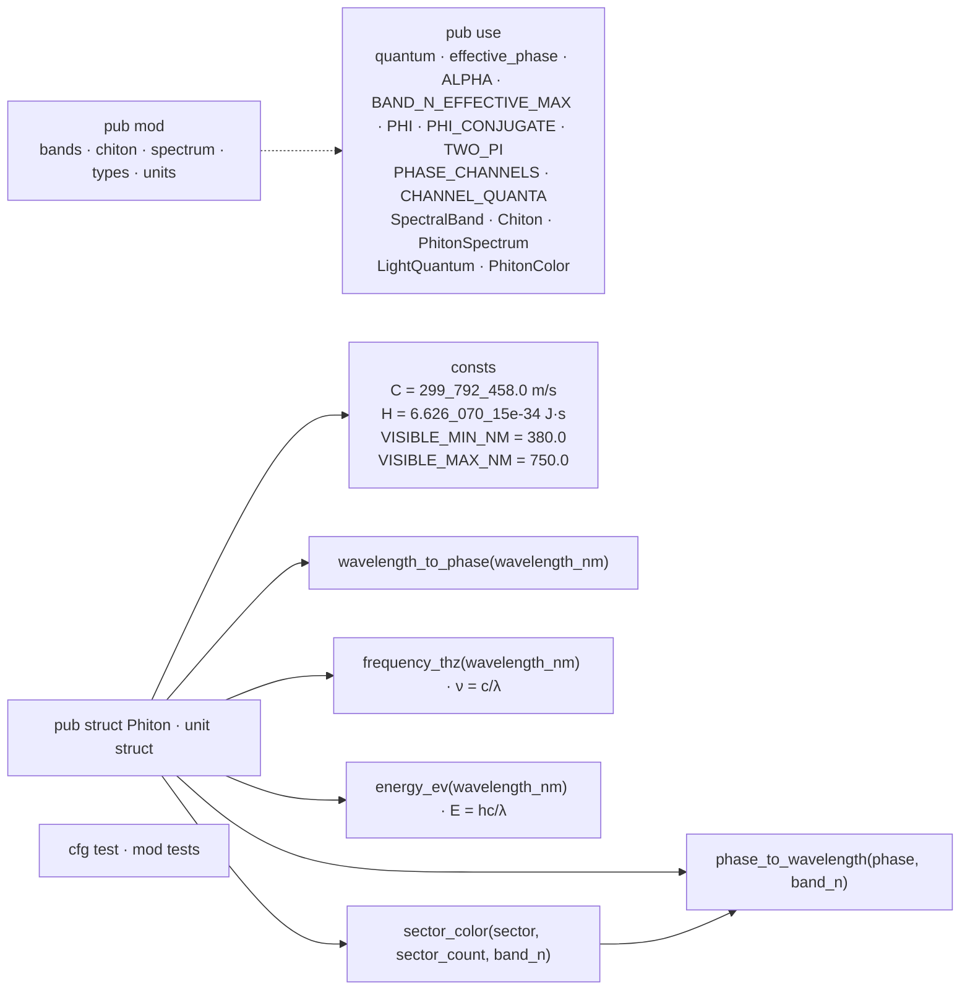
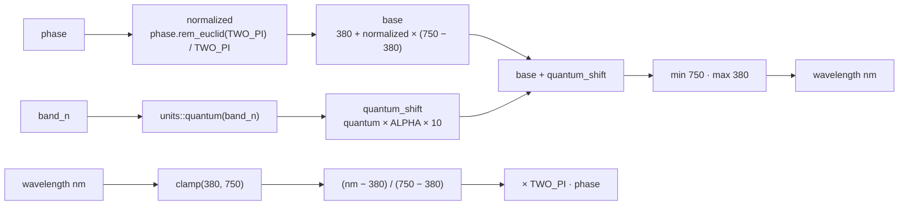
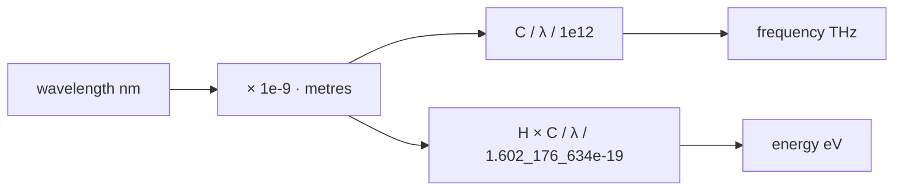
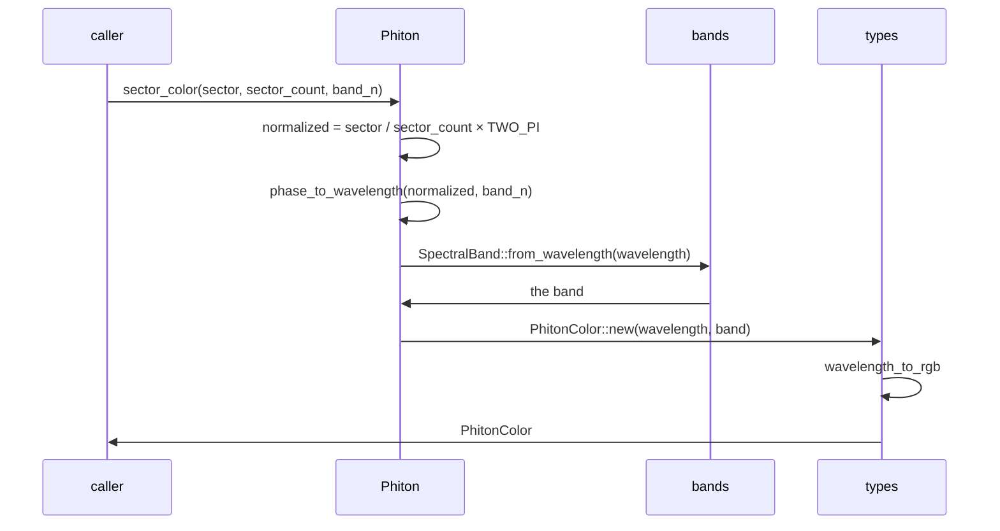
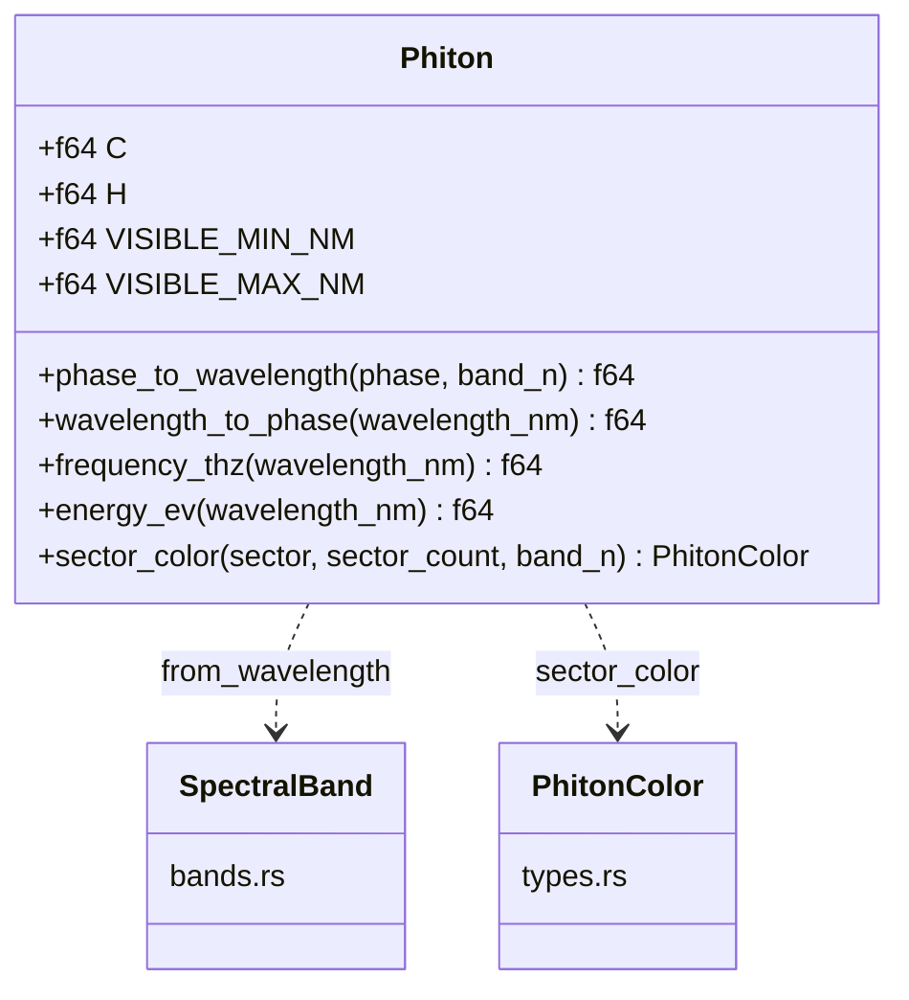
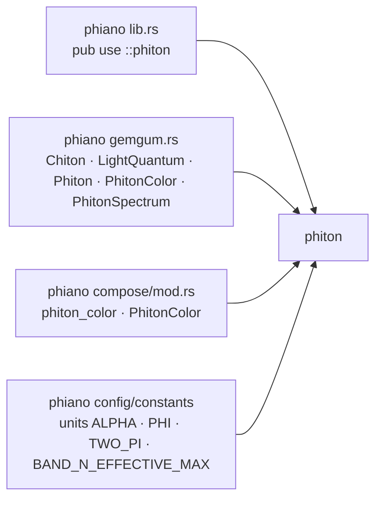

# lib

## Inside lib.rs

```mermaid
graph LR
    mods["pub mod<br/>bands · chiton · spectrum · types · units"]
    reex["pub use<br/>quantum · effective_phase · ALPHA · BAND_N_EFFECTIVE_MAX · PHI · PHI_CONJUGATE · TWO_PI<br/>PHASE_CHANNELS · CHANNEL_QUANTA<br/>SpectralBand · Chiton · PhitonSpectrum<br/>LightQuantum · PhitonColor"]
    ph["pub struct Phiton · unit struct"]
    k["consts<br/>C = 299_792_458.0 m/s<br/>H = 6.626_070_15e-34 J·s<br/>VISIBLE_MIN_NM = 380.0<br/>VISIBLE_MAX_NM = 750.0"]
    f1["phase_to_wavelength(phase, band_n)"]
    f2["wavelength_to_phase(wavelength_nm)"]
    f3["frequency_thz(wavelength_nm) · ν = c/λ"]
    f4["energy_ev(wavelength_nm) · E = hc/λ"]
    f5["sector_color(sector, sector_count, band_n)"]
    t["cfg test · mod tests"]

    ph --> k
    ph --> f1
    ph --> f2
    ph --> f3
    ph --> f4
    ph --> f5
    f5 --> f1
    mods -.-> reex
```

## A phase to a wavelength, and back

```mermaid
flowchart LR
    P["phase"] --> N["normalized<br/>phase.rem_euclid(TWO_PI) / TWO_PI"]
    N --> BASE["base<br/>380 + normalized × (750 − 380)"]
    BN["band_n"] --> Q["units::quantum(band_n)"]
    Q --> SHIFT["quantum_shift<br/>quantum × ALPHA × 10"]
    BASE --> ADD["base + quantum_shift"]
    SHIFT --> ADD
    ADD --> CL["min 750 · max 380"] --> NM["wavelength nm"]
    NM2["wavelength nm"] --> CL2["clamp(380, 750)"] --> N2["(nm − 380) / (750 − 380)"] --> PH2["× TWO_PI · phase"]
```

## Light's physics

```mermaid
flowchart LR
    NM["wavelength nm"] --> M["× 1e-9 · metres"]
    M --> F["C / λ / 1e12"] --> THZ["frequency THz"]
    M --> E["H × C / λ / 1.602_176_634e-19"] --> EV["energy eV"]
```

## A sector's colour

```mermaid
sequenceDiagram
    participant U as caller
    participant P as Phiton
    participant B as bands
    participant T as types
    U->>P: sector_color(sector, sector_count, band_n)
    P->>P: normalized = sector / sector_count × TWO_PI
    P->>P: phase_to_wavelength(normalized, band_n)
    P->>B: SpectralBand::from_wavelength(wavelength)
    B->>P: the band
    P->>T: PhitonColor::new(wavelength, band)
    T->>T: wavelength_to_rgb
    T->>U: PhitonColor
```

## The type

```mermaid
classDiagram
    class Phiton {
        +f64 C
        +f64 H
        +f64 VISIBLE_MIN_NM
        +f64 VISIBLE_MAX_NM
        +phase_to_wavelength(phase, band_n) f64
        +wavelength_to_phase(wavelength_nm) f64
        +frequency_thz(wavelength_nm) f64
        +energy_ev(wavelength_nm) f64
        +sector_color(sector, sector_count, band_n) PhitonColor
    }
    class PhitonColor {
        types.rs
    }
    class SpectralBand {
        bands.rs
    }
    Phiton ..> SpectralBand : from_wavelength
    Phiton ..> PhitonColor : sector_color
```

## Who reads it from outside

```mermaid
graph LR
    phiano["phiano lib.rs<br/>pub use ::phiton"]
    gem["phiano gemgum.rs<br/>Chiton · LightQuantum · Phiton · PhitonColor · PhitonSpectrum"]
    comp["phiano compose/mod.rs<br/>phiton_color · PhitonColor"]
    conf["phiano config/constants<br/>units ALPHA · PHI · TWO_PI · BAND_N_EFFECTIVE_MAX"]
    lib["phiton"]
    phiano --> lib
    gem --> lib
    comp --> lib
    conf --> lib
```
