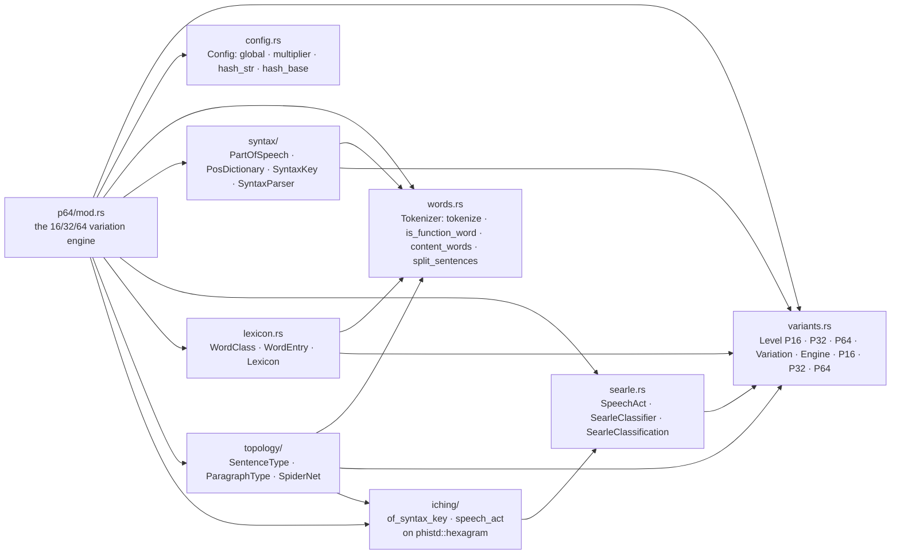
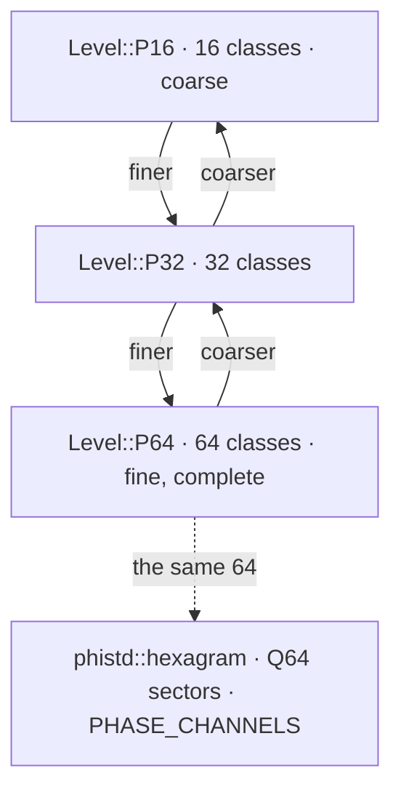
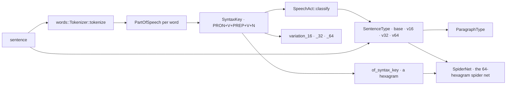
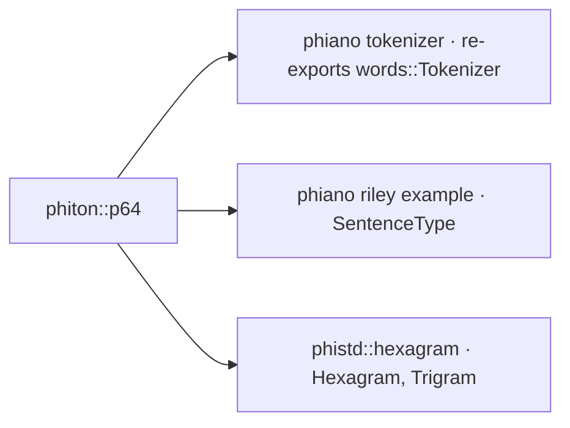

# p64

## Files

```mermaid
graph LR
    mod_["p64/mod.rs<br/>the 16/32/64 variation engine"]
    variants["variants.rs<br/>Level P16 · P32 · P64 · Variation · Engine · P16 · P32 · P64"]
    config["config.rs<br/>Config: global · multiplier · hash_str · hash_base"]
    words["words.rs<br/>Tokenizer: tokenize · is_function_word · content_words · split_sentences"]
    syntax["syntax/<br/>PartOfSpeech · PosDictionary · SyntaxKey · SyntaxParser"]
    searle["searle.rs<br/>SpeechAct · SearleClassifier · SearleClassification"]
    lexicon["lexicon.rs<br/>WordClass · WordEntry · Lexicon"]
    topology["topology/<br/>SentenceType · ParagraphType · SpiderNet"]
    iching["iching/<br/>of_syntax_key · speech_act<br/>on phistd::hexagram"]
    mod_ --> variants & config & words & syntax & searle & lexicon & topology & iching
    syntax & lexicon & topology --> words
    syntax & searle & lexicon & topology --> variants
    topology --> iching --> searle
```

## The three levels

```mermaid
graph TD
    P16["Level::P16 · 16 classes · coarse"] -->|"finer"| P32["Level::P32 · 32 classes"] -->|"finer"| P64["Level::P64 · 64 classes · fine, complete"]
    P64 -->|"coarser"| P32 -->|"coarser"| P16
    P64 -.->|"the same 64"| H["phistd::hexagram · Q64 sectors · PHASE_CHANNELS"]
```

## A sentence read

```mermaid
flowchart LR
    S["sentence"] --> T["words::Tokenizer::tokenize"]
    T --> POS["PartOfSpeech per word"] --> K["SyntaxKey · PRON+V+PREP+V+N"]
    K --> ACT["SpeechAct::classify"]
    K --> HEX["of_syntax_key · a hexagram"]
    K --> V["variation_16 · _32 · _64"]
    ACT & S --> ST["SentenceType · base · v16 · v32 · v64"]
    ST --> PT["ParagraphType"]
    ST & HEX --> NET["SpiderNet · the 64-hexagram spider net"]
```

## Who reads it

```mermaid
graph LR
    P["phiton::p64"] --> TOK["phiano tokenizer · re-exports words::Tokenizer"]
    P --> RI["phiano riley example · SentenceType"]
    P --> HX["phistd::hexagram · Hexagram, Trigram"]
```
