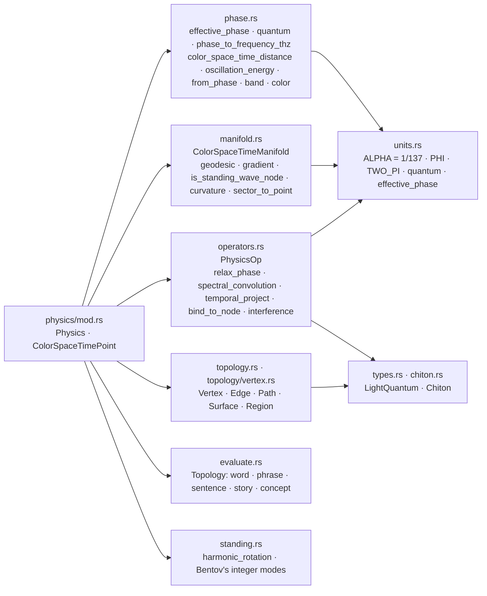
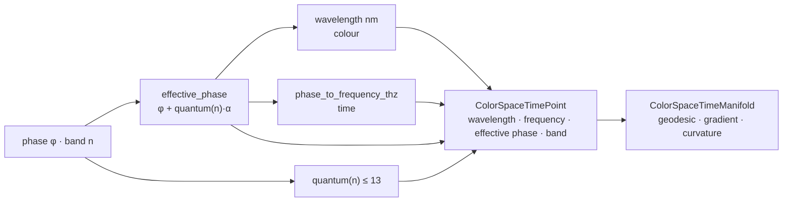
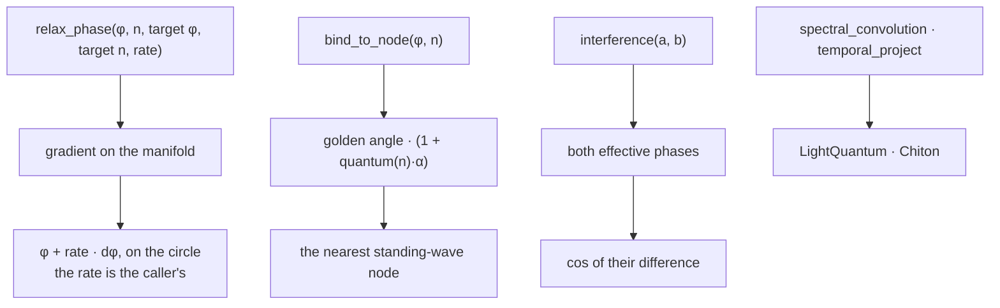
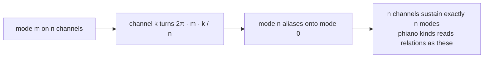
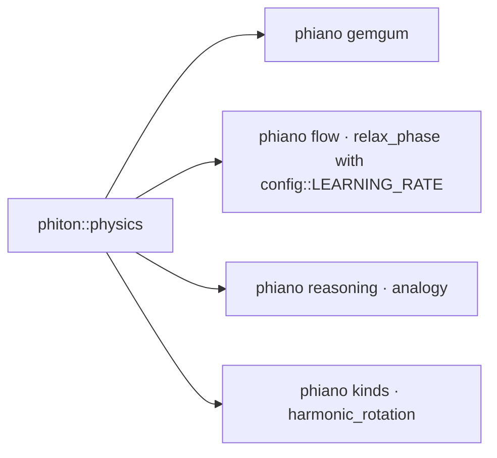

# physics

## Files

```mermaid
graph LR
    mod_["physics/mod.rs<br/>Physics · ColorSpaceTimePoint"]
    phase["phase.rs<br/>effective_phase · quantum · phase_to_frequency_thz<br/>color_space_time_distance · oscillation_energy · from_phase · band · color"]
    manifold["manifold.rs<br/>ColorSpaceTimeManifold<br/>geodesic · gradient · is_standing_wave_node · curvature · sector_to_point"]
    ops["operators.rs<br/>PhysicsOp<br/>relax_phase · spectral_convolution · temporal_project · bind_to_node · interference"]
    topo["topology.rs · topology/vertex.rs<br/>Vertex · Edge · Path · Surface · Region"]
    eval["evaluate.rs<br/>Topology: word · phrase · sentence · story · concept"]
    standing["standing.rs<br/>harmonic_rotation · Bentov's integer modes"]
    units["units.rs<br/>ALPHA = 1/137 · PHI · TWO_PI · quantum · effective_phase"]
    lq["types.rs · chiton.rs<br/>LightQuantum · Chiton"]
    mod_ --> phase & manifold & ops & topo & eval & standing
    phase & manifold & ops --> units
    ops & topo --> lq
```

## A word as a point of colour, space and time

```mermaid
flowchart LR
    W["phase φ · band n"] --> EP["effective_phase<br/>φ + quantum(n)·α"]
    EP --> L["wavelength nm<br/>colour"]
    EP --> F["phase_to_frequency_thz<br/>time"]
    W --> Q["quantum(n) ≤ 13"]
    L & F & EP & Q --> P["ColorSpaceTimePoint<br/>wavelength · frequency · effective phase · band"]
    P --> M["ColorSpaceTimeManifold<br/>geodesic · gradient · curvature"]
```

## The operators

```mermaid
flowchart TD
    R["relax_phase(φ, n, target φ, target n, rate)"] --> G["gradient on the manifold"] --> N["φ + rate · dφ, on the circle<br/>the rate is the caller's"]
    B["bind_to_node(φ, n)"] --> GA["golden angle · (1 + quantum(n)·α)"] --> NODE["the nearest standing-wave node"]
    I["interference(a, b)"] --> EF["both effective phases"] --> C["cos of their difference"]
    S["spectral_convolution · temporal_project"] --> LQ["LightQuantum · Chiton"]
```

## Standing waves — standing.rs

```mermaid
flowchart LR
    M["mode m on n channels"] --> ROT["channel k turns 2π · m · k / n"]
    ROT --> A["mode n aliases onto mode 0"]
    A --> BOUND["n channels sustain exactly n modes<br/>phiano kinds reads relations as these"]
```

## Who reads it

```mermaid
graph LR
    PH["phiton::physics"] --> GG["phiano gemgum"]
    PH --> FL["phiano flow · relax_phase with config::LEARNING_RATE"]
    PH --> RA["phiano reasoning · analogy"]
    PH --> KI["phiano kinds · harmonic_rotation"]
```
