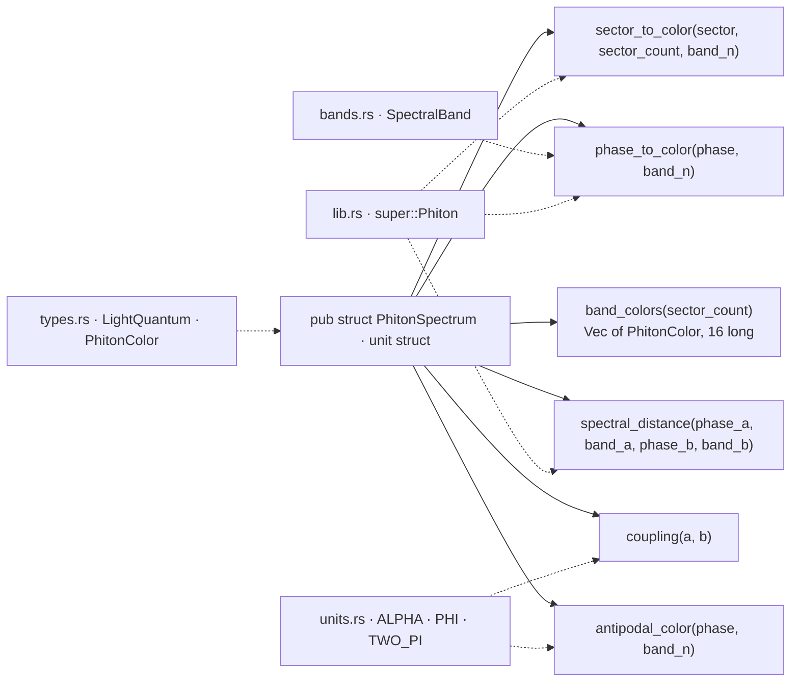
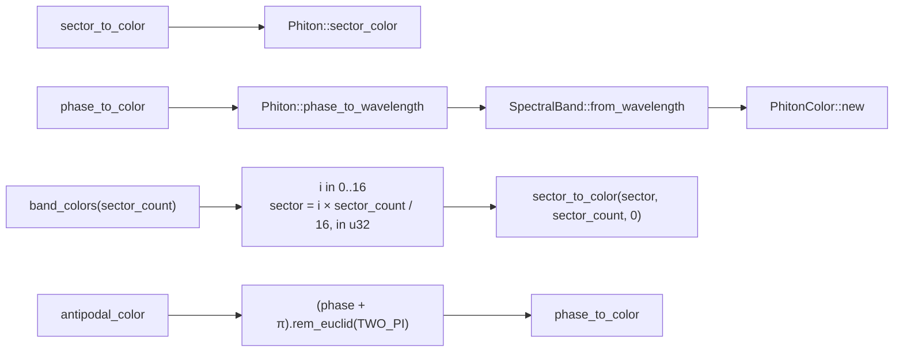
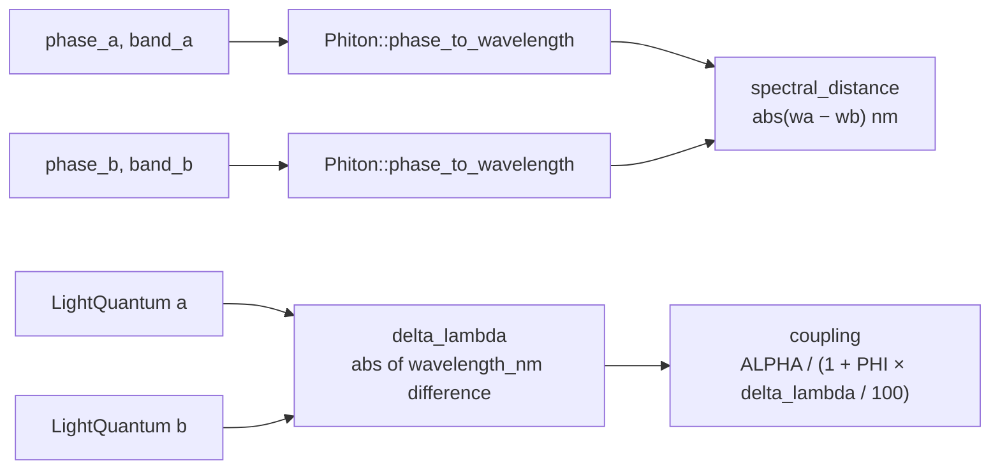
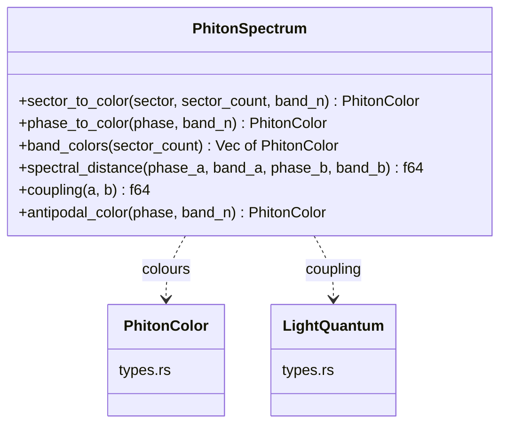

# spectrum

## Inside spectrum.rs

```mermaid
graph LR
    ps["pub struct PhitonSpectrum · unit struct"]
    s2c["sector_to_color(sector, sector_count, band_n)"]
    p2c["phase_to_color(phase, band_n)"]
    bc["band_colors(sector_count)<br/>Vec of PhitonColor, 16 long"]
    sd["spectral_distance(phase_a, band_a, phase_b, band_b)"]
    cp["coupling(a, b)"]
    ac["antipodal_color(phase, band_n)"]
    bands["bands.rs · SpectralBand"]
    types["types.rs · LightQuantum · PhitonColor"]
    units["units.rs · ALPHA · PHI · TWO_PI"]
    lib["lib.rs · super::Phiton"]
    ps --> s2c
    ps --> p2c
    ps --> bc
    ps --> sd
    ps --> cp
    ps --> ac
    bands -.-> p2c
    types -.-> ps
    units -.-> cp
    units -.-> ac
    lib -.-> s2c
    lib -.-> p2c
    lib -.-> sd
```

## Where each call goes

```mermaid
flowchart LR
    S2C["sector_to_color"] --> SC["Phiton::sector_color"]
    P2C["phase_to_color"] --> PW["Phiton::phase_to_wavelength"] --> FW["SpectralBand::from_wavelength"] --> NEW["PhitonColor::new"]
    BC["band_colors(sector_count)"] --> LP["i in 0..16<br/>sector = i × sector_count / 16, in u32"] --> S2C2["sector_to_color(sector, sector_count, 0)"]
    AC["antipodal_color"] --> OPP["(phase + π).rem_euclid(TWO_PI)"] --> P2C2["phase_to_color"]
```

## Distance and coupling

```mermaid
flowchart LR
    PA["phase_a, band_a"] --> WA["Phiton::phase_to_wavelength"]
    PB["phase_b, band_b"] --> WB["Phiton::phase_to_wavelength"]
    WA --> SD["spectral_distance<br/>abs(wa − wb) nm"]
    WB --> SD
    QA["LightQuantum a"] --> DL["delta_lambda<br/>abs of wavelength_nm difference"]
    QB["LightQuantum b"] --> DL
    DL --> CP["coupling<br/>ALPHA / (1 + PHI × delta_lambda / 100)"]
```

## The type

```mermaid
classDiagram
    class PhitonSpectrum {
        +sector_to_color(sector, sector_count, band_n) PhitonColor
        +phase_to_color(phase, band_n) PhitonColor
        +band_colors(sector_count) Vec of PhitonColor
        +spectral_distance(phase_a, band_a, phase_b, band_b) f64
        +coupling(a, b) f64
        +antipodal_color(phase, band_n) PhitonColor
    }
    class PhitonColor {
        types.rs
    }
    class LightQuantum {
        types.rs
    }
    PhitonSpectrum ..> PhitonColor : colours
    PhitonSpectrum ..> LightQuantum : coupling
```
