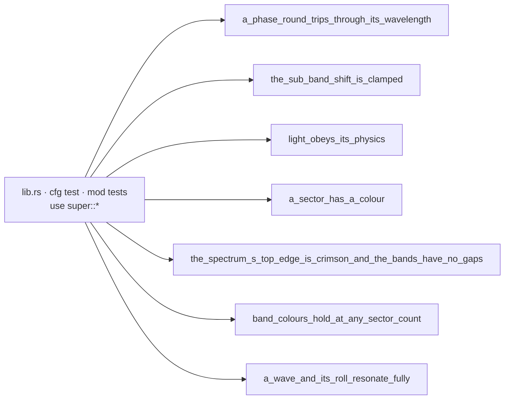
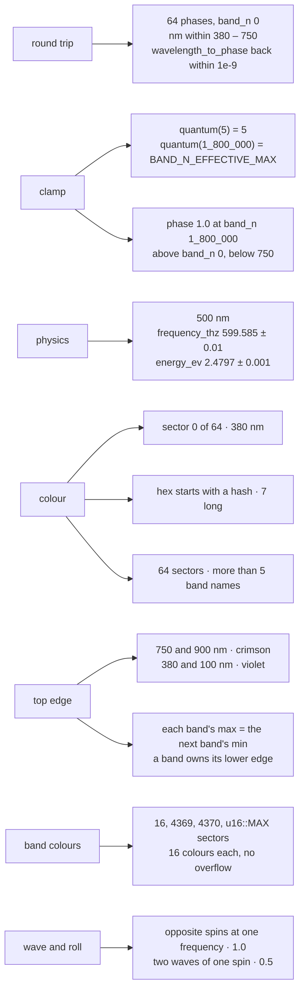
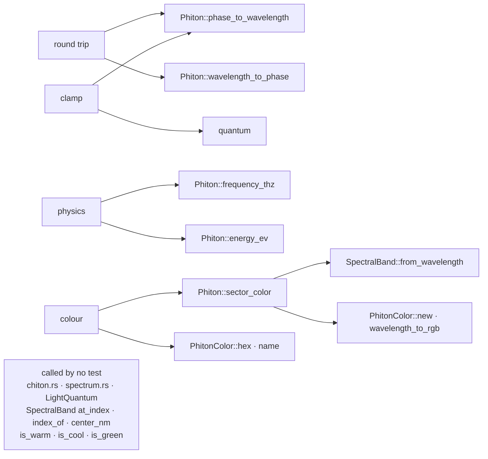

# tests

## Inside tests.rs

```mermaid
graph LR
    m["lib.rs · cfg test · mod tests<br/>use super::*"]
    t1["a_phase_round_trips_through_its_wavelength"]
    t2["the_sub_band_shift_is_clamped"]
    t3["light_obeys_its_physics"]
    t4["a_sector_has_a_colour"]
    t5["the_spectrum_s_top_edge_is_crimson_and_the_bands_have_no_gaps"]
    t6["band_colours_hold_at_any_sector_count"]
    t7["a_wave_and_its_roll_resonate_fully"]
    m --> t1
    m --> t2
    m --> t3
    m --> t4
    m --> t5
    m --> t6
    m --> t7
```

## What each test pins

```mermaid
flowchart LR
    T1["round trip"] --> T1a["64 phases, band_n 0<br/>nm within 380 – 750<br/>wavelength_to_phase back within 1e-9"]
    T2["clamp"] --> T2a["quantum(5) = 5<br/>quantum(1_800_000) = BAND_N_EFFECTIVE_MAX"]
    T2 --> T2b["phase 1.0 at band_n 1_800_000<br/>above band_n 0, below 750"]
    T3["physics"] --> T3a["500 nm<br/>frequency_thz 599.585 ± 0.01<br/>energy_ev 2.4797 ± 0.001"]
    T4["colour"] --> T4a["sector 0 of 64 · 380 nm"]
    T4 --> T4b["hex starts with a hash · 7 long"]
    T4 --> T4c["64 sectors · more than 5 band names"]
    T5["top edge"] --> T5a["750 and 900 nm · crimson<br/>380 and 100 nm · violet"]
    T5 --> T5b["each band's max = the next band's min<br/>a band owns its lower edge"]
    T6["band colours"] --> T6a["16, 4369, 4370, u16::MAX sectors<br/>16 colours each, no overflow"]
    T7["wave and roll"] --> T7a["opposite spins at one frequency · 1.0<br/>two waves of one spin · 0.5"]
```

## What they touch

```mermaid
graph LR
    T1["round trip"] --> PW["Phiton::phase_to_wavelength"]
    T1 --> WP["Phiton::wavelength_to_phase"]
    T2 --> Q["quantum"]
    T2["clamp"] --> PW
    T3["physics"] --> FT["Phiton::frequency_thz"]
    T3 --> EE["Phiton::energy_ev"]
    T4["colour"] --> SC["Phiton::sector_color"]
    T4 --> HX["PhitonColor::hex · name"]
    SC --> FW["SpectralBand::from_wavelength"]
    SC --> NEW["PhitonColor::new · wavelength_to_rgb"]
    U["called by no test<br/>chiton.rs · spectrum.rs · LightQuantum<br/>SpectralBand at_index · index_of · center_nm<br/>is_warm · is_cool · is_green"]
```
