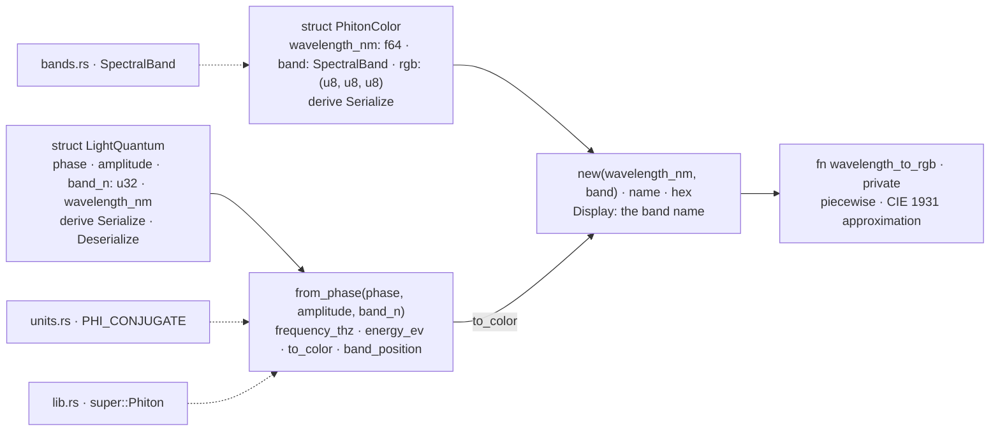
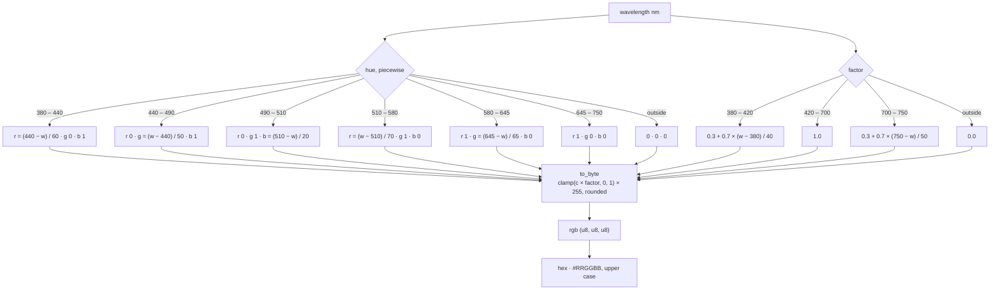
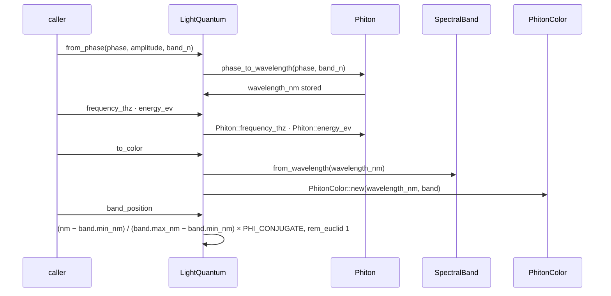
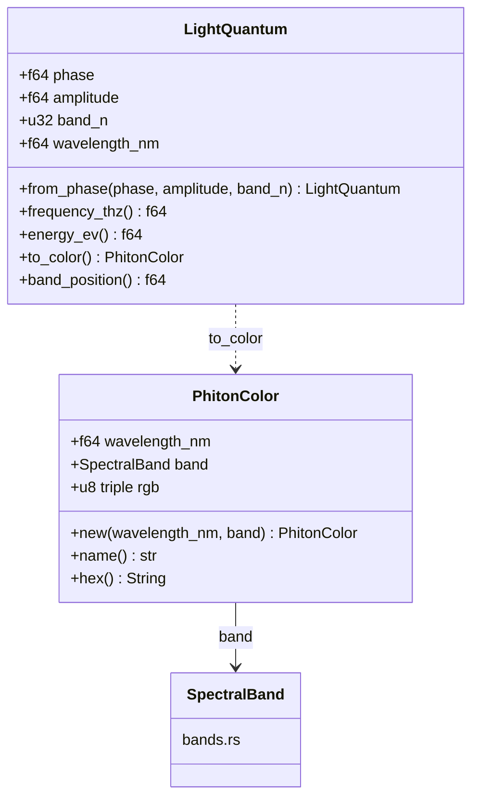

# types

## Inside types.rs

```mermaid
graph LR
    pc["struct PhitonColor<br/>wavelength_nm: f64 · band: SpectralBand · rgb: (u8, u8, u8)<br/>derive Serialize"]
    pcf["new(wavelength_nm, band) · name · hex<br/>Display: the band name"]
    lq["struct LightQuantum<br/>phase · amplitude · band_n: u32 · wavelength_nm<br/>derive Serialize · Deserialize"]
    lqf["from_phase(phase, amplitude, band_n)<br/>frequency_thz · energy_ev · to_color · band_position"]
    rgb["fn wavelength_to_rgb · private<br/>piecewise · CIE 1931 approximation"]
    bands["bands.rs · SpectralBand"]
    units["units.rs · PHI_CONJUGATE"]
    lib["lib.rs · super::Phiton"]
    pc --> pcf
    lq --> lqf
    pcf --> rgb
    lqf -->|"to_color"| pcf
    bands -.-> pc
    units -.-> lqf
    lib -.-> lqf
```

## A wavelength to RGB

```mermaid
flowchart TD
    W["wavelength nm"] --> P{"hue, piecewise"}
    P -->|"380 – 440"| P1["r = (440 − w) / 60 · g 0 · b 1"]
    P -->|"440 – 490"| P2["r 0 · g = (w − 440) / 50 · b 1"]
    P -->|"490 – 510"| P3["r 0 · g 1 · b = (510 − w) / 20"]
    P -->|"510 – 580"| P4["r = (w − 510) / 70 · g 1 · b 0"]
    P -->|"580 – 645"| P5["r 1 · g = (645 − w) / 65 · b 0"]
    P -->|"645 – 750"| P6["r 1 · g 0 · b 0"]
    P -->|"outside"| P7["0 · 0 · 0"]
    W --> F{"factor"}
    F -->|"380 – 420"| F1["0.3 + 0.7 × (w − 380) / 40"]
    F -->|"420 – 700"| F2["1.0"]
    F -->|"700 – 750"| F3["0.3 + 0.7 × (750 − w) / 50"]
    F -->|"outside"| F4["0.0"]
    P1 & P2 & P3 & P4 & P5 & P6 & P7 --> BY["to_byte<br/>clamp(c × factor, 0, 1) × 255, rounded"]
    F1 & F2 & F3 & F4 --> BY
    BY --> RGB["rgb (u8, u8, u8)"] --> HEX["hex · #RRGGBB, upper case"]
```

## A quantum

```mermaid
sequenceDiagram
    participant U as caller
    participant Q as LightQuantum
    participant P as Phiton
    participant B as SpectralBand
    participant C as PhitonColor
    U->>Q: from_phase(phase, amplitude, band_n)
    Q->>P: phase_to_wavelength(phase, band_n)
    P->>Q: wavelength_nm stored
    U->>Q: frequency_thz · energy_ev
    Q->>P: Phiton::frequency_thz · Phiton::energy_ev
    U->>Q: to_color
    Q->>B: from_wavelength(wavelength_nm)
    Q->>C: PhitonColor::new(wavelength_nm, band)
    U->>Q: band_position
    Q->>Q: (nm − band.min_nm) / (band.max_nm − band.min_nm) × PHI_CONJUGATE, rem_euclid 1
```

## The types

```mermaid
classDiagram
    class PhitonColor {
        +f64 wavelength_nm
        +SpectralBand band
        +u8 triple rgb
        +new(wavelength_nm, band) PhitonColor
        +name() str
        +hex() String
    }
    class LightQuantum {
        +f64 phase
        +f64 amplitude
        +u32 band_n
        +f64 wavelength_nm
        +from_phase(phase, amplitude, band_n) LightQuantum
        +frequency_thz() f64
        +energy_ev() f64
        +to_color() PhitonColor
        +band_position() f64
    }
    class SpectralBand {
        bands.rs
    }
    PhitonColor --> SpectralBand : band
    LightQuantum ..> PhitonColor : to_color
```
