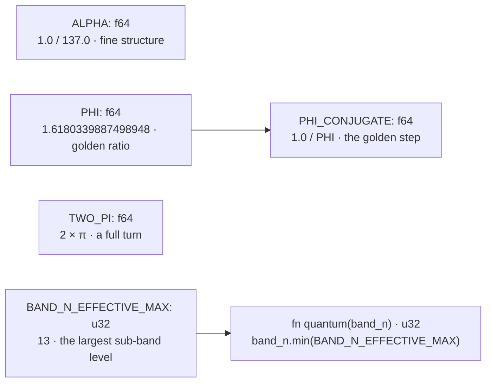
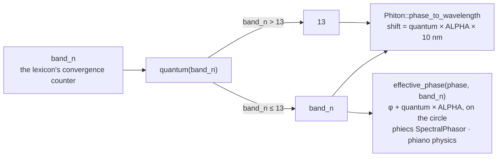
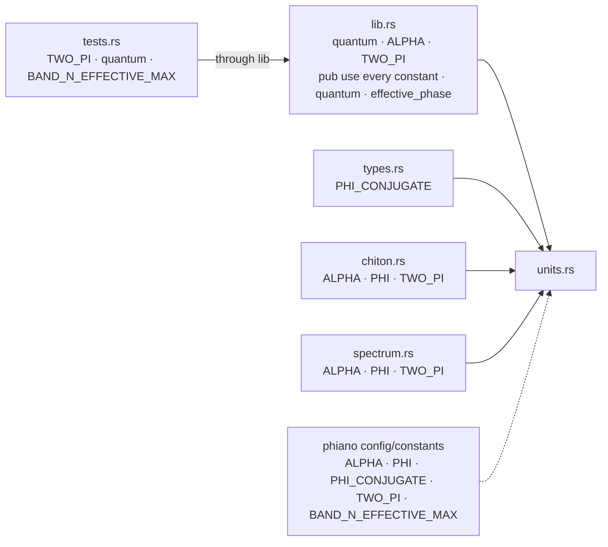

# units

## Inside units.rs

```mermaid
graph LR
    alpha["ALPHA: f64<br/>1.0 / 137.0 · fine structure"]
    phi["PHI: f64<br/>1.6180339887498948 · golden ratio"]
    conj["PHI_CONJUGATE: f64<br/>1.0 / PHI · the golden step"]
    phi --> conj
    two["TWO_PI: f64<br/>2 × π · a full turn"]
    max["BAND_N_EFFECTIVE_MAX: u32<br/>13 · the largest sub-band level"]
    q["fn quantum(band_n) · u32<br/>band_n.min(BAND_N_EFFECTIVE_MAX)"]
    max --> q
```

## The clamp

```mermaid
flowchart LR
    BN["band_n<br/>the lexicon's convergence counter"] --> Q["quantum(band_n)"]
    Q -->|"band_n ≤ 13"| SAME["band_n"]
    Q -->|"band_n #gt; 13"| TOP["13"]
    SAME --> USE["Phiton::phase_to_wavelength<br/>shift = quantum × ALPHA × 10 nm"]
    SAME --> EP["effective_phase(phase, band_n)<br/>φ + quantum × ALPHA, on the circle<br/>phiecs SpectralPhasor · phiano physics"]
    TOP --> USE
```

## Who reads which constant

```mermaid
graph LR
    units["units.rs"]
    lib["lib.rs<br/>quantum · ALPHA · TWO_PI<br/>pub use every constant · quantum · effective_phase"]
    types["types.rs<br/>PHI_CONJUGATE"]
    chiton["chiton.rs<br/>ALPHA · PHI · TWO_PI"]
    spectrum["spectrum.rs<br/>ALPHA · PHI · TWO_PI"]
    tests["tests.rs<br/>TWO_PI · quantum · BAND_N_EFFECTIVE_MAX"]
    phiano["phiano config/constants<br/>ALPHA · PHI · PHI_CONJUGATE · TWO_PI · BAND_N_EFFECTIVE_MAX"]
    lib --> units
    types --> units
    chiton --> units
    spectrum --> units
    tests -->|"through lib"| lib
    phiano -.-> units
```
